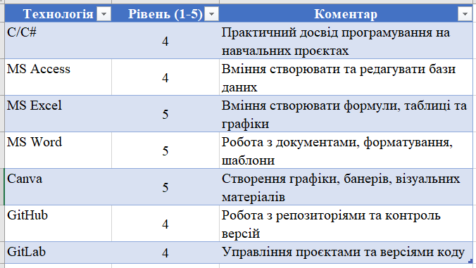

# Про мене

Привіт! Мене звати **Ільчук Уляна Вікторівна**. Я захоплююся **інформаційними технологіями та роботою з інформаційними системами**, прагну поглиблювати знання у сфері IT та управління IT-проєктами.  

## Ключові компетенції

- Програмування на **C/C#**  
- Робота з **MS Access**  
- Робота з **MS Excel**  
- Робота з **MS Word**  
- Створення графіки та матеріалів у **Canva**  
- Робота з **GitHub** та **GitLab**  

## Рівень володіння технологіями

Нижче наведено таблицю рівня володіння технологіями (скріншот Excel):  

