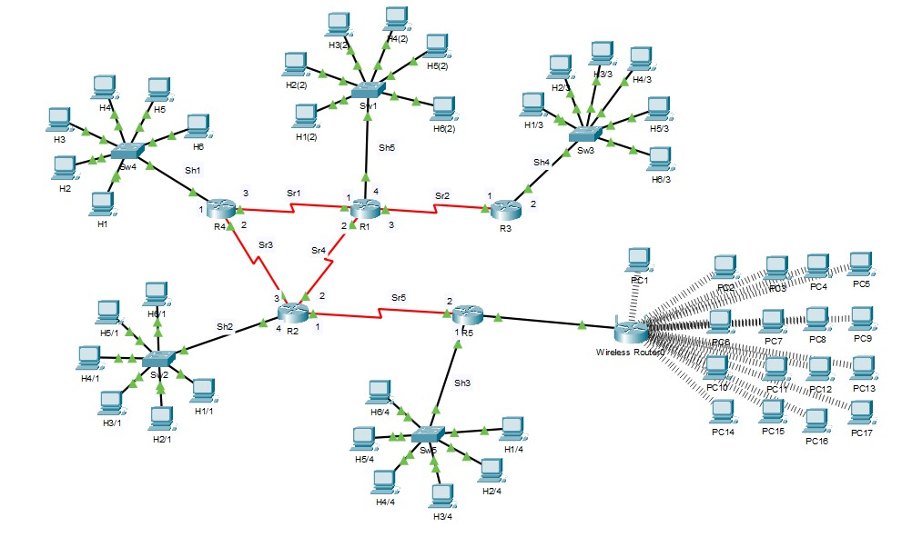

# Мої проєкти

## Проєкт 1: Інформаційна система «Каса аеропорту»

Короткий опис: Створення інформаційної системи для ведення списку рейсів аеропорту, пошуку рейсів за різними ознаками та ведення довідника маршрутів.  

Використані технології: **C#** та **Visual Studio**  

### Блок-схема роботи проєкту

---

## Проєкт 2: Проєктування комп’ютерної мережі підприємства «BRAINS»

Короткий опис: Розробка та моделювання комп’ютерної мережі підприємства, включаючи планування структури, підключення вузлів і маршрутизацію.  

Використані технології: **Cisco Packet Tracer, Draw.io**  

### Блок-схема роботи проєкту

