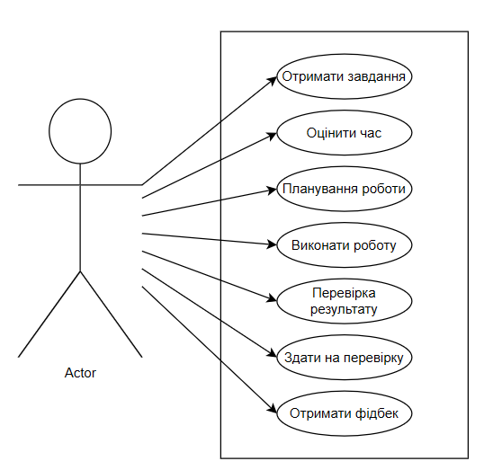

# Процес роботи

Мій підхід до виконання завдань включає такі етапи:

1. **Отримати завдання** – отримую інформацію про нове завдання від системи.  
2. **Оцінити час** – оцінюю приблизний час виконання завдання.  
3. **Планування роботи** – визначаю порядок дій, пріоритети та ресурси.  
4. **Виконати роботу** – реалізовую завдання відповідно до вимог.  
5. **Перевірка результату** – самоперевірка або тестування перед здачею.  
6. **Здати на перевірку** – передаю готову роботу на оцінку.  
7. **Отримати фідбек** – отримую коментарі та зауваження для покращення результату.  

### UML 

На діаграмі показано взаємодію користувача (**Я**) з системою керування проєктами через всі ключові прецеденти:

